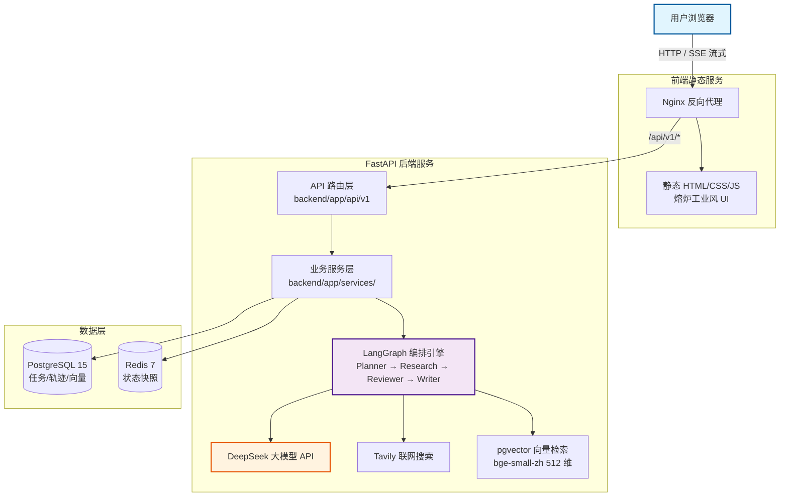

# AgentForge

基于 LangGraph 的多智能体 Agent Runtime 平台：Planner 拆解任务 → Research 检索证据 → Reviewer 质检结果 → Writer 成文报告，支持流式对话、企业知识库 RAG、节点级执行轨迹可视化与断点续跑。

## 核心特性

- **多 Agent 工作流**：LangGraph 状态图 + 条件边编排，Reviewer 质检不通过自动回炉重试（最多 2 次），避免死循环
- **Agentic RAG**：企业知识库（pgvector + bge-small-zh-v1.5 中文向量检索）与 Tavily 联网搜索双通道取证，内部资料优先
- **断点续跑**：AsyncPostgresSaver 持久化执行状态，失败任务可一键从 Checkpoint 恢复
- **可观测**：每个节点记录耗时 / token 消耗 / 输入输出，前端以时间线呈现完整执行轨迹
- **流式对话**：SSE 流式输出，支持中断停止（省 token）
- **知识库**：PDF / Markdown / TXT / DOCX 上传，自动解析、分块、向量化入库

## 技术栈

- Backend: FastAPI + SQLAlchemy 2.0 (async)
- Agent: LangChain + LangGraph + DeepSeek API
- Database: PostgreSQL 15 + pgvector + Redis 7
- Embedding: BAAI/bge-small-zh-v1.5（本地，512 维）
- Search: Tavily（联网检索）
- Deployment: Docker Compose + Nginx + 纯静态前端（零构建）

## 系统架构图



## 快速启动

### 前置要求

- Docker Desktop
- DeepSeek API key、Tavily API key

### 启动步骤

1. **克隆项目**

   ```bash
   git clone https://github.com/xinguix/AgentForge.git
   cd AgentForge
   ```

2. **配置环境变量**：编辑 `.env`，至少填入 API key（完整键名见下方「环境变量」）

   ```
   DEEPSEEK_API_KEY=sk-xxxxxxxxxxxxxxxx
   TAVILY_API_KEY=tvly-xxxxxxxxxxxxxxxx
   ```

3. **一键启动**

   ```bash
   make build        # 等价于 docker compose up -d --build
   ```

4. **访问**

   - 前端页面: http://localhost:8080
   - API 文档: http://localhost:8000/docs

常用命令：`make logs`（全量日志）、`make logs-backend`、`make restart`、`make clean`（停服务保留数据）、`make shell`（进入 backend 容器）。

## 环境变量（.env）

| 键 | 说明 |
|----|------|
| `DEEPSEEK_API_KEY` | DeepSeek API 密钥（必填） |
| `DEEPSEEK_BASE_URL` | DeepSeek 接口地址，默认 `https://api.deepseek.com/v1` |
| `DEFAULT_MODEL` | 默认模型，默认 `deepseek-chat` |
| `TAVILY_API_KEY` | Tavily 搜索密钥（必填） |
| `DATABASE_URL` | PostgreSQL 连接串（compose 已配好） |
| `REDIS_URL` | Redis 连接串（compose 已配好） |
| `UPLOAD_DIR` | 文档上传目录，默认 `./uploads` |
| `PROJECT_NAME` / `ENV` | 项目名 / 运行环境 |

## API 接口

| 方法 | 路径 | 说明 |
|------|------|------|
| GET | `/api/health` | 健康检查 |
| POST | `/api/v1/chat/` | 对话（走完整 LangGraph 工作流） |
| POST | `/api/v1/chat/stream` | 对话（SSE 流式，直连 LLM） |
| POST | `/api/v1/tasks/plan` | 创建任务并执行（Planner 自动拆解，同步返回） |
| GET | `/api/v1/tasks/` | 任务列表（分页） |
| GET | `/api/v1/tasks/{id}` | 任务详情（含完整 Plan） |
| GET | `/api/v1/tasks/{id}/status` | 快速状态查询 |
| POST | `/api/v1/tasks/{id}/resume` | 失败任务断点续跑 |
| GET | `/api/v1/tasks/{id}/trace` | 执行轨迹汇总（节点数/总耗时/总 token） |
| GET | `/api/v1/tasks/{id}/trace/raw` | 轨迹原始数据（含节点输入输出） |
| POST | `/api/v1/documents/upload` | 上传文档（pdf/md/txt/docx）→ 解析 → 向量化入库 |
| POST | `/api/v1/agents/` | 创建 Agent |
| GET | `/api/v1/agents/` | Agent 列表 |
| DELETE | `/api/v1/agents/{id}` | 删除 Agent |

请求/响应参数详情见 Swagger 文档（`/docs`）。

## 知识库（RAG）

上传文档后自动执行：解析纯文本 → 按 500 字符分块 → bge-small-zh-v1.5 本地向量化（512 维）→ 写入 pgvector。检索时内部知识库与 Tavily 联网搜索**双通道并行**，内部资料优先作为回答依据，联网结果仅作补充。

## 自动化评估

`tests/evaluate.py` 对 20 道题（10 道联网检索题 + 10 道本地知识库题）做端到端回归：

```bash
python tests/evaluate.py      # 需后端已在 localhost:8000 运行
```

判定标准：API 请求成功且输出命中全部期望关键词。报告写入 `tests/evaluation_report_YYYYMMDD_HHMMSS.json`。

**最新结果：90% 正确率（18/20）**，平均耗时约 35s/题，详见 `tests/evaluation_report_20260807_150233.json`。

## 项目结构

```
AgentForge/
|--backend/
|  |--app/
|  |   |--api/v1/            # 路由层（agents/chat/tasks/documents）
|  |   |--core/              # 配置、数据库、LangGraph 图、LLM、四个 Agent 节点
|  |   |--models/            # SQLAlchemy ORM（users/agent/tasks/runs/messages/document_chunks）
|  |   |--schemas/           # Pydantic 请求/响应
|  |   |--services/          # 业务逻辑（任务、轨迹、对话、向量、文档解析）
|  |   |--tools/             # Tavily 搜索封装
|  |--Dockerfile
|--frontend/
|  |--html/                  # 前端（index.html + css/ + js/，纯静态）
|  |--Dockerfile
|  |--nginx.conf             # 反向代理 /api/ → backend
|--tests/                    # 自动化评估（evaluate.py + 20 题 + 报告）
|--docs/decisions.md         # 架构决策记录（ADR）
|--Makefile                  # 常用命令入口
|--docker-compose.yml
|--.env
```

## Roadmap

- [x] Multi-Agent Workflow（Planner → Research → Reviewer → Writer）
- [x] Agentic RAG（pgvector + BGE Embedding，内部资料优先）
- [x] Trace 可视化（节点时间线 + token/耗时统计）
- [ ] Tool Registry（工具注册与调用）
