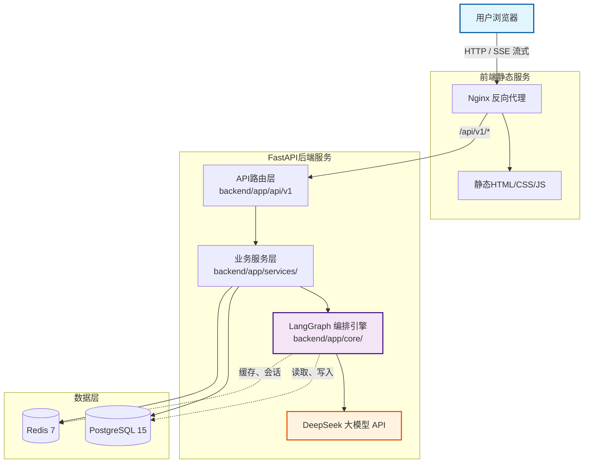

# AgentForge
基于LangGraph的多智能体Agent Runtime平台，支持Agent编排、流式对话和工具调用

---

## 技术栈

- Backend: FastAPI + SQLAlchemy 2.0 (async)
- Agent: LangChain + LangGraph + DeepSeek API
- Database: PostgreSQL 15 + Redis 7
- Deployment: Docker Compose + Nginx

---

## 系统架构图



---

## 项目结构
```
AgentForge/
|--backend/
|  |--app/
|  |   |--api/v1            #路由层
|  |   |--core/             #核心配置、数据库连接、LangGraph图定义、大模型配置
|  |   |--models/           #SQLAlchemy ORM模型
|  |   |--schemas/          #Pydantic 请求、响应体
|  |   |--services/         #业务逻辑（Agent 编排、对话处理）
|  | --Dockerfile
|  | --main.py
|  | --requirements.txt
|--docker
|--frontend/
|  |--html/
|  |--Dockerfile
|  |--nginx.conf
|--.env
|--.gitignore
|--docker-compose.yml
|--README.md

```

## 快速启动

### 前置要求
- Docker Desktop
- DeepSeek API key

### 启动步骤

1. **克隆项目**
    ```bash
    git clone https://github.com/xinguix/AgentForge.git
    cd AgentForge
    ```

2. **配置环境变量**
   编辑 `.env`，至少填入你的 API key：
   ```
   DEEPSEEK_API_KEY=sk-xxxxxxxxxxxxxxxx
   ```

3. **一键启动**
   ```bash
   docker compose up -d --build
   ```

4. **访问**
   - 前端页面: http://localhost:8080 【如果你映射了不同端口，请自行修改】
   - API 文档: http://localhost:8000/docs 【FastAPI 默认端口】

> 提示：如果启动后前端无法访问，请检查 `docker-compose.yml` 中的端口映射是否与上述一致。

---

## API 接口

| 方法 | 路径 | 说明 |
|------|------|------|
| GET | `/api/health` | 健康检查 |
| POST | `/api/v1/agents` | 创建 Agent |
| GET | `/api/v1/agents` | 获取 Agent 列表 |
| DELETE | `/api/v1/agents/{id}` | 删除 Agent |
| POST | `/api/v1/chat` | 对话（返回完整响应） |
| POST | `/api/v1/chat/stream` | 对话（SSE 流式） |

更详细的请求/响应参数请查看 Swagger 文档（`/docs`）。

---

## Roadmap

- [ ] Multi-Agent Workflow（Planner → Research → Reviewer）
- [ ] Agentic RAG（pgvector + BGE Embedding）
- [ ] Tool Registry（工具注册与调用）
- [ ] Trace 可视化（LangSmith 或自研）

---